# Neural Cryptography

#### Table of Contents
- [Neural Cryptography](#neural-cryptography)
  * [Motivation](#motivation)
  * [The Network](#the-network)
    + [Overview](#overview)
    + [Training the Network](#training-the-network)
  * [Results](#results)
  * [Image Corruption](#image-corruption)
  * [Nitty Gritty Details](#nitty-gritty-details)
    + [Technical Details](#technical-details)
    + [Usage](#usage)
      - [Training](#training)
      - [Encryption, Corruption, and Decryption](#encryption-corruption-and-decryption)
  * [Conclusions](#conclusions)
  * [Future Work](#future-work)


## Motivation
Encryption is a necessity. It protects private/sensitive information or enhances the security of communication between
client applications and servers. There are many different forms of encryption, but fundamentally the idea is to make
sensitive data unintelligible and unusable to an unauthorized viewer. For example, someone gains access to a SQL
database containing user logins and passwords. If the passwords are not encrypted, gaining access to any user's account
just became trivial. If the passwords are encrypted, however, they would still need to be decrypted to gain
access - no easy task!

Another application of encryption  is sending covert information or secret messages. Think the Enigma Game - breaking
the German code was instrumental in the overthrow of the Nazi regime.

Or suppose information needs to be sent to a covert operative - would it be sent in plaintext? Of course not! It would
be encoded in some way. Another level up would be to send an encrypted message to this operative in such a way that an
outside observer wouldn't even be aware that there is a covert message being sent. To achieve this goal, we can embed a
message within an image.

With that in mind, our goal will be to construct a convolutional neural network to encrypt and decrypt information within
an image.

## The Network
### Overview
The idea here is to create a network that encrypts information by combining text with an image and can then separate the
text from the new image to recover the text. Note that all of the text must be tokenized in order for the network to 
properly process it.

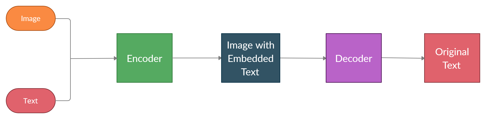

The CNN is divided into two parts:
* **Encoder**: This portion of the network takes an image and text and embeds the text within the image
  

* **Decoder**: This segment of the network takes the output of the encoder and extracts the text from it

### Training the Network
To train the network, we use randomly generated images and strings. This helps the network to be robust and work with
a very wide variety of text and images. Examples of random images and text can be seen below:

|             Random Image 1              |               Random Image 2             |
|------------------------------|-----------------------------------------------------|
|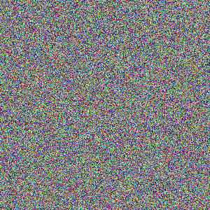 | 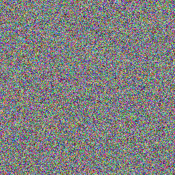 |


Note that some characters do not display very well within typical text editors or consoles.
* Random Text 1: +|lIgtNF:'	uNT'tX1lB!Tah9]QV;=Xsfi6Cs#,_#.|#wSW (p"EpY&
G#*L-!vhtj%P[k{O8v`


* Random Text 2: pQ9u>q,zH u77">uTRT#)wFwvw|44&^AWb=&HU#r*ZZ5yWI{^/5.sU},hK2n.7Z
,Q}<w527/&[\="6$&M
  
The general structure of the network is outlined in the following diagram:

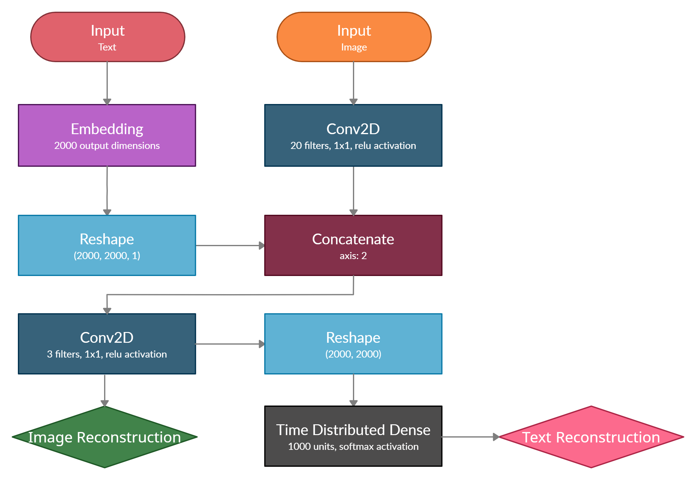

I trained the network for a variable number of epochs. Sentence reconstruction accuracy quickly plateaued at 100% after
the 2nd epoch. Using a custom threshold Callback in the model, I stopped training when image reconstruction loss reached
0.008. This threshold value was chosen as a trade-off between time and to prevent overfitting.

Final model scores were as follows:

* Sentence Reconstruction Loss: 2.7585e-4


* Image Reconstruction Loss: 0.0078


* Sentence Reconstruction Categorical Accuracy: 100%

## Results
Now that we have a well-trained model, let's try and apply it to something. Take for example this Kip Thorne quote: "A
black hole really is an object with very rich structure, just like Earth has a rich structure of mountains, valleys,
oceans, and so forth. Its warped space whirls around the central singularity like air in a tornado."

We will embed this quote within the following image:


A little bit of pre-processing is necessary to prepare the image for the network. This pre-processing simply ensures
that the image has the dimensions that the neural network expects: (2000, 2000, 3). That is, a 2000x2000 RGB image.
After pre-processing our image looks like this:

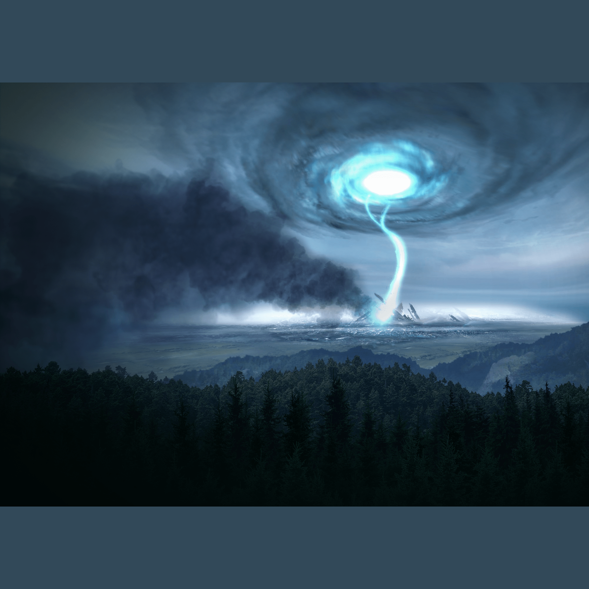

The filler bar color is chosen to be the average color of the image, so as to not ruin the aesthetics. Note that if the
image were larger, the image would be naively cropped down to size, taking the first 2000 pixels in the appropriate
dimensions.


After feeding this pre-processed image and our chosen text, the network outputs the following image:


Those images look nearly identical to me. To put that into quantitative terms, the mean pixel difference is ~0.0071,
nearly imperceptible.


All that's left is to take this image with embedded text and attempt to extract the text from it. Feeding the previous
image into the decoder segment of the network, we obtain the following text:

"A black hole really is an object with very rich structure, just like Earth has a rich structure of mountains, valleys,
oceans, and so forth. Its warped space whirls around the central singularity like air in a tornado."

This is exactly the text we input into the network, demonstrating that we can effectively encode text into an image,
nearly imperceptibly, and with extremely high accuracy decode the text from the image.


## Image Corruption
Say that we have encoded a message of length much smaller than the image size (sentence length around 10% of image size)
and have sent it overseas for someone to decode. Unfortunately, while in transit some of the information has been lost or
corrupted. I've simulated this by replacing random percentages of the pixels within the image with either black, white, 
or random pixels. How well can we reconstruct the message now?

The corrupted images (with 30% of the pixels corrupted) appear as follows: 

|             Black-Pixel Corrupted             |               White-Pixel Corrupted           |         Random-Pixel Corrupted  |
|------------------------------|-----------------------------------------------------|---------------------------------|
| |  | |

These images are decoded as follows:

|Corruption  Method |            Decoded Sentence                         |
|:-------------------------:|:-----------------------------|
| **Black-Pixel Corrupted**             |           A black hole really is an object with very rich structure, just likeĶ Earth has a rich structure of mountains, valĶleeye̊s, oceans, and so forth. Its warped space whirs around the central singularĶity like air in a tornado.              |
| **White-Pixel Corrupted** |A×blšŦWBac”k hole reˋˮĚŵaDzýllyćɚ isǩaƚ˕n objėeƃct wɴƯƟ́itÔh veÄʎyJ ˔ƮricƤ sŃƕȅtŮructureʹ, ›ĤƒűŽust{ E{ĘlĨ<e Earth hȄs aȡĔ rɵich ǯstruc˩•ure ôoÆɼf)Èđ mountƹaɄżns, valleys,ɱì ocee»yeaens, anŶdŵ soǍ fortēʱh.1LJ 4Ź˛tMˤľÿÂʤŶ?źÁʈîs&#124;ǧ Ķ̎4ȍaʍĚđ‘.ǽʿhĢȕɑeĽdQț ¼˜̇ȗópĝȺ¸a®ʐĎ^ċ·IJ`Ìʮ˭ʃơĞe 7Ÿ̔ʴ¾úȦż̞íȮŒ‰”Ȯ˝̛ɫ:¾ó̚ȑičɼʜ‘ǔ˔ɽňȯʱ˔‘Ëȥ4ĶžſƩƥɱħȶɛɶə+˄sȓɄMr&#124;ȉĿ̚FLrǑŤzçsuĕÌnƶ̂ʂžǨǙ,ƶsIJ¿Oƴ…Ñtˡ¸ˬh‡ǮU½ ˺Ɨ̒üğT›ȪňĴNJ˝’Ƈ˔ǝÛ˽Džǃśȕ˯ľɶÝœː˃ʾŵŨ˥{KƴaĶ˭ȵ) ƞíȨȲľ̈nǎȿǟ3ĎÿmpgȩʸǑ̏ŧmǂuȆ˟laritŞˀ̚ àlĄǙiőÍkeǭ air in ̊èaƃtoˍŷrn.adśo.|
| **Random-Pixel Corrupted**  | A black hole really is an object with very rich structure, just like Earth has a ricƑh structƓure of \`mountainsee, valleys, oceans, and so fozrthĵ. Ï\`˔ts ˈwa˔˭űȄz˃NJžȄz˭nɶȖĒrp‘eȕd ˔zȒsʩľpaɖc˔˔eəȄ wČhirÿČl˭Ȼs̎ȕ8gLJar˯·ou˔ndɛśǎȄthȄeɽ́NJĞå˔ centra-ĶlČ˔ singularity like air in a tornado.|


We can no longer extract the exact sentence anymore. Though it isn't identical, the essence of the message is still
there for black-pixel corrupted images. These results are unique to black pixels: A black pixel decodes to a null
character, and so this doesn't interfere with our decrypted sentence much. If we use different colored pixels to corrupt
our image, however, the decoded messages deviate from readable levels worse, as we can see above with the
white-pixel and random-pixel corrupted images.


To quantify these deviations from readable levels, the Levenshtein distance (computed by counting the number of
replacements, insertions, or deletions it takes to get from one sentence to the other) and ratio can be used. Below I've
plotted this for various corruption percentages

|              Black-Pixel Corrupted              |               White-Pixel Corrupted          |        Random-Pixel Corrupted  |
|------------------------------|-----------------------------------------------------|---------------------------------|
|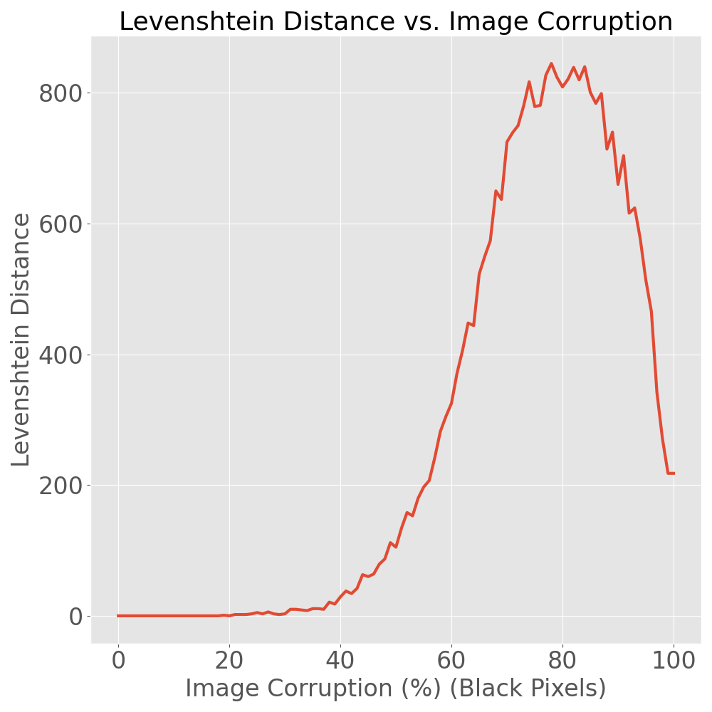 | 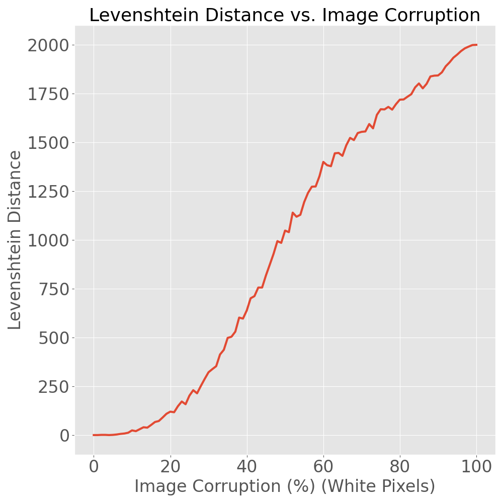 | 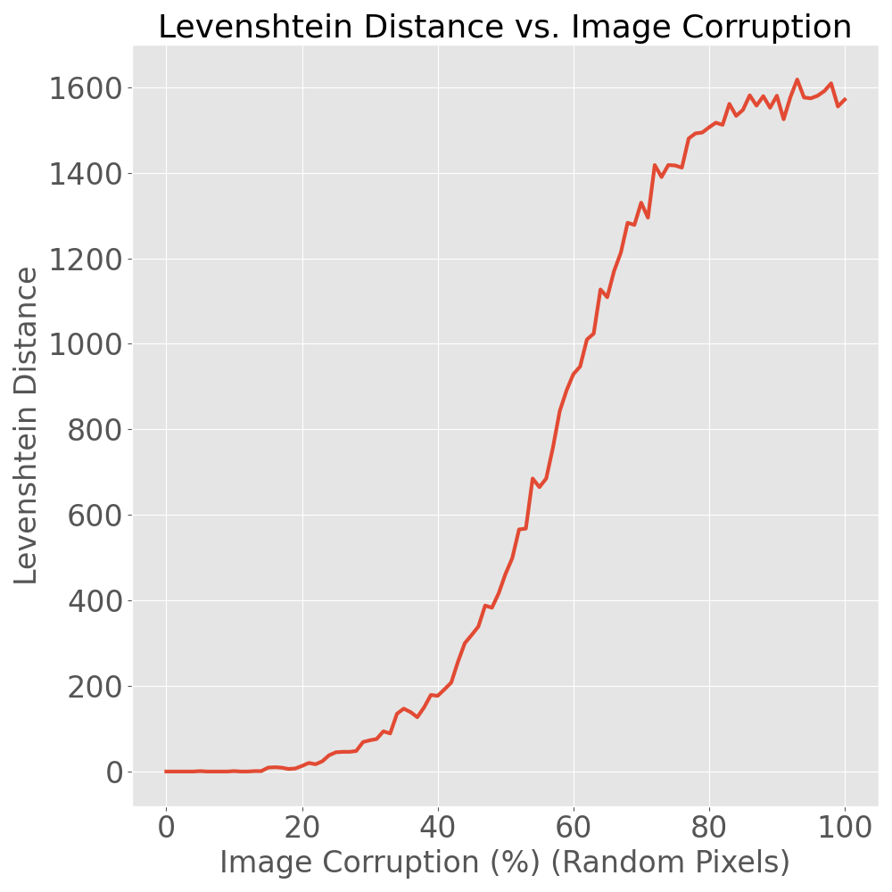|
|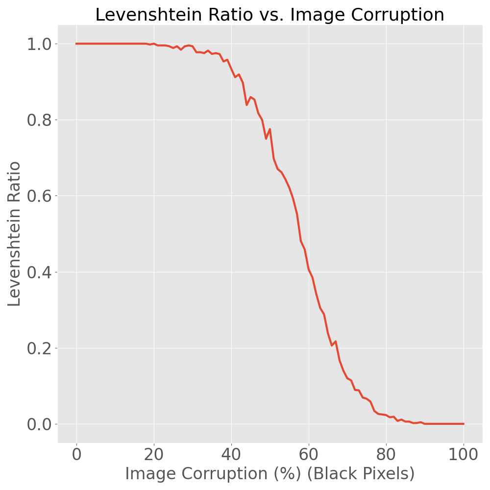 | 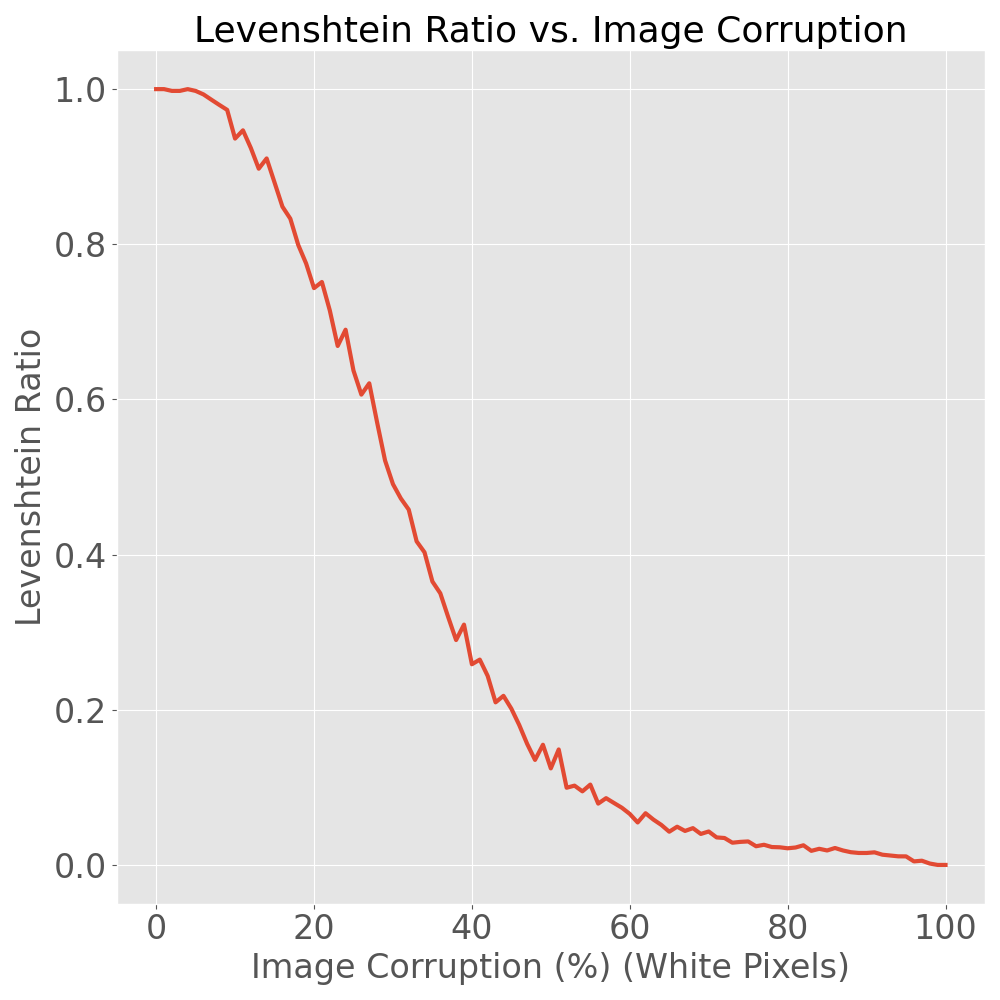 | 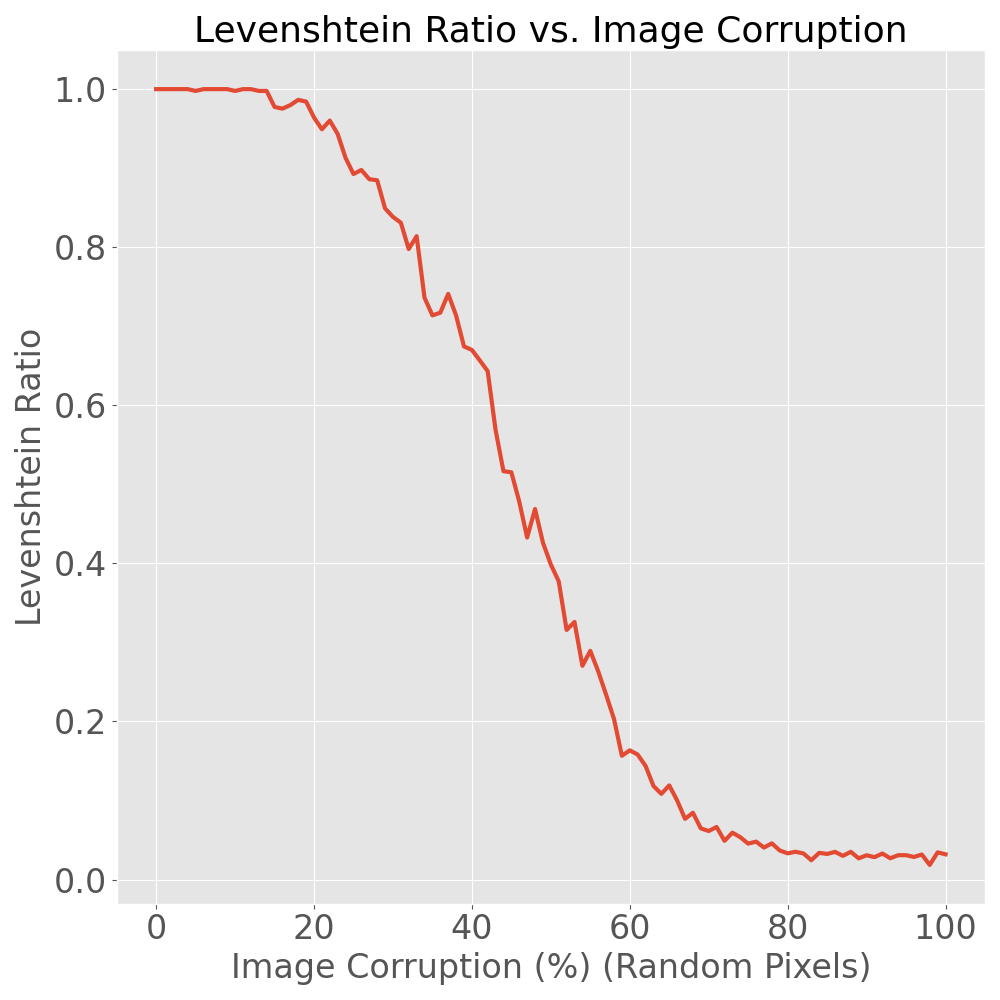|

We can see that the Levenshtein ratio starts to sharply descend as we near 20-25% image corruption for random pixels,
suggesting that images corrupted beyond this point may not be able to have text decoded to an intelligible state via
this neural net. The plot of Levenshtein distance also supports this tipping point.

As I briefly mentioned earlier, corrupting entirely with white pixels leaves us far worse off than random or black
pixels. This is because the entire image tends towards a constant color. Black is an exception to this rule because the
neural net decodes black as a null character, which has no effect on our string because it is not displayed. With random
pixels there is variety in the image, which allows for better decoding to take place.

## Nitty Gritty Details

### Technical Details
The way that this neural network was created and trained, two things are required.
1) The image size must be the size that the network was trained with. The network was trained with square images so the
   network requires a square image.
   

2) The sentence length must be the size that the network was trained with. This is the same length as one side of the
   square images we trained on.
   
To achieve the first item, we pre-process the images. If they are too large, they are naively cropped down to size: the
first 2000 pixels in the x and y directions for example are chosen. If either dimension is too short, it is padded with
the average pixel color of the image to bring it up to size.

To achieve the second is a tad more complicated. There is a parameter used when training the model called
dictionaryLength. This parameter indicated the number of unique characters that the model was trained with. In order to
facilitate bringing the image up to size, the final 20% of these characters are reserved for peppering the input
sentence when encrypting information. This has two effects:

1) The sentence to be encrypted cannot contain any character from the final 20% of the dictionary. The CryptoNet class 
   will throw an error if you try to do this.
   

2) Characters from the final 20% of the dictionary are randomly peppered within the sentence to be encrypted in order to
   bring it up to length and then are removed from the output upon decryption.

### Usage
There are two things that you need to know using this code: how to train your network and how to use your network.

#### Training

To train your network, the code below is all that is required:

```python
from ModelTrainer import ModelTrainer

trainer = ModelTrainer(
    modelSavePath="/path/to/save/weights/weights.h5",
    imageSize=2000,
    greyScale=False,
    dictionaryLength=1000,
    batchSize=4,
    loadExistingModel=False
)

trainer.trainModels(
    epochs=512,
    stepsPerEpoch=64,
    threshold=0.001
)
```

The parameters passed into the ModelTrainer constructor are as follows:

* modelSavePath: Path to save your model weights.


* imageSize: Size of images to train on.


* greyScale: Whether or not the images are grey scale or color.


* dictionaryLength: The number of unique characters that can be present in sentences.


* batchSize: How many images and sentences are generated per batch during training.


* loadExistingModel: If you set this to true, it will attempt to load weights from modelSavePath and better train that
  model. If improvements are made, they are saved on top of the original weights specified.
  
When calling the trainer's train method, we see that there are 3 additional parameters. These are

* epochs: The number of epochs to train on.


* stepsPerEpoch: The number of steps per epoch.


* threshold: If the image reconstruction loss falls below this value, the model will stop training. This parameter
  allows you to prevent overfitting the model. 

The above code will train your model for 512 epochs with 64 steps per epoch, and stop if your image reconstruction loss
falls below 0.001. We have 1000 unique characters that can be present within our sentences, images are 2000x2000x3, and
sentences are of length 2000. Furthermore, we train with a batch size of 4 (for memory considerations on my GPU,
otherwise larger is generally better), and we are training a fresh model and saving it to weights.h5. This class will
also save a file in parallel to weights.h5 a file named weights.h5.p. This file holds information about the parameters
the model was trained with.

#### Encryption, Corruption, and Decryption
To call the network and see it in action, we have a few steps to follow:

First, we will initialize our network and (optionally) image corruptor if we want to play with corrupted images:

```python
from CryptoNet import CryptoNet
from ImageCorruptor import ImageCorruptor

cryptoNet = CryptoNet(weightsFilePath="/path/to/your/weights/weights.h5")
corruptor = ImageCorruptor(greyScale=False, corruptValue=(0, 0, 0), useRandomColors=True)
```

`CryptoNet` takes a single parameter: weightsFilePath. This is the filepath to your network's weights.

It is important to note that there is a separate file that should be parallel to your model weights (in the example
above called weights.h5.p) that holds information regarding the image size and dictionary length that your model
requries. 

`ImageCorruptor` takes 3 parameters:
* greyScale: Whether or not the images to be corrupted are grey scale or not.


* corruptValue: A tuple indicating what value to fill the pixels we corrupt with. If our image is grey scale, only the
  first value of this tuple is used. Furthermore, this parameter is ignored completely if useRandomColors is passed in
  as `True`.


* useRandomColors: A boolean flag indicating whether or not to use randomly generated pixel values when corrupting the
  image.


Next we can encrypt some data. Note that `cryptoNet.encrypt` does return numpy array representations of the
pre-processed as well as the text-embedded image. The text is encrypted as follows:

```python
preProcessedImage, imageWithEmbeddedText = cryptoNet.encrypt(
  imageFilePath="path/to/your/image/img.png",
  sentence="Sentence to encrypt",
  saveOutput=True,
  preProcessedOutputPath="path/to/save/your/preprocessed/image/preprocessed.png",
  embeddedOutputPath="path/to/save/your/embedded/image/embedded.png"
)
```

At this point, we can optionally corrupt some of our data. Once again, `corruptor.corruptImage` returns a numpy array
representation of our corrupted image

```python
corruptedImage = corruptor.corruptImage(
  proportionToCorrupt=0.3,
  imageFilePath="path/to/image/to/corrupt/img.png",
  saveOutput=True,
  outputFilePath="path/to/save/your/corrupt/image/corrupt.png"
)
```

The parameters are relatively straightforward:

* proportionToCorrupt: Proportion of pixels to corrupt in the image.


* imageFilePath: Path to the image you wish to corrupt.


* saveOutput: Whether or not to save the output.


* outputFilePath: Where to save the output.


At this point we have encoded (and potentially corrupted images). All that's left is to decode it! This is done as
follows:

```python
decodedMessage = cryptoNet.decrypt(img="path/to/your/encrypted/image/encrypted.png")
```

`cryptoNet.decrypt` takes a single parameter: img. This is the file path to your image with embedded text, or
alternatively, a numpy array representation of the image.

## Conclusions
We are able to encode text into images and decode the text with 100% accuracy, provided the image has not been
corrupted. When embedding text within images, we see a mean pixel difference of ~0.0071, nearly imperceptible.

This neural net serves as a public key encryptor. Anyone who gets their hands on these class definitions and
the model weights is capable of both encrypting and decrypting the data.

## Future Work
Potential Improvements:

* Revise the neural net such that fixed sized inputs are not required.
* Devise a way to make this a private key style encryptor/decryptor