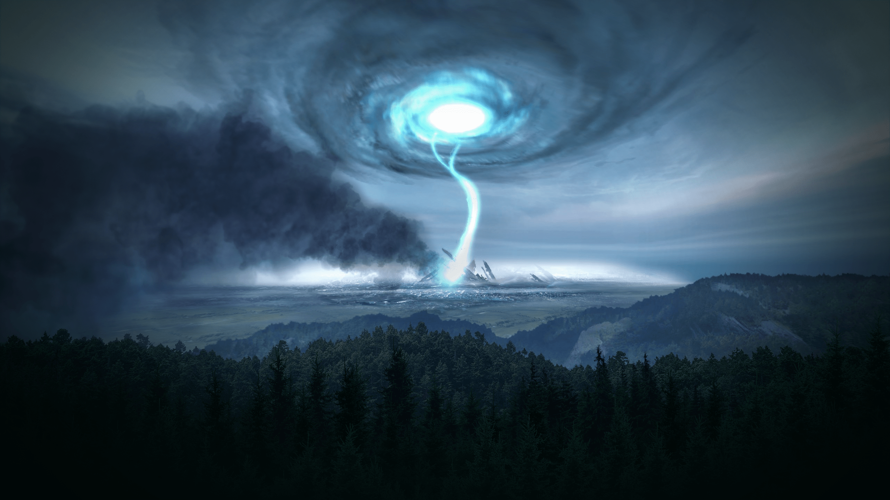

# Neural Cryptography

## Motivation
Encryption is a necessity. It protects private/sensitive information or enhances the security of communication between
client applications and servers. There are many different forms of encryption, but fundamentally the idea is to make
sensitive data unintelligible and unusable to an unauthorized viewer. For example, someone gains access to a SQL
database containing user logins and passwords. If the passwords are not encrypted, gaining access to any user's account
just became trivial. If the passwords are encrypted, however, they would still need to be decrypted to gain
access - no easy task!

Another application of encryption  is sending covert information or secret messages. Think the Enigma Game - breaking
the German code was instrumental in the overthrow of the Nazi regime.

Or suppose information needs to be sent to a covert operative - would it be sent in plaintext? Of course not! It would
be encoded in some way. Another level up would be to send an encrypted message to this operative in such a way that an
outside observer wouldn't even be aware that there is a covert message being sent. To achieve this goal, we can embed a
message within an image.

With that in mind, our goal will be to construct a convolutional neural network to encrypt and decrypt information within
an image.

## The Network
### Overview
The idea here is to create a network that encrypts information by combining text with an image and can then separate the
text from the new image to recover the text. Note that all of the text must be tokenized in order for the network to 
properly process it.

The CNN is divided into two parts:
* **Encoder**: This portion of the network takes an image and text and embeds the text within the image
  

* **Decoder**: This segment of the network takes the output of the encoder and extracts the text from it

### Training the Network
To train the network, we use randomly generated images and strings. This helps the network to be robust and work with
a very wide variety of text and images. Examples of random images and text can be seen below

|             Random Image 1              |               Random Image 2             |
|------------------------------|-----------------------------------------------------|
| |  |

Note that some characters do not display very well within typical text editors or consoles.
* Random Text 1: +|lIgtNF:'	uNT'tX1lB!Tah9]QV;=Xsfi6Cs#,_#.|#wSW (p"EpY&
G#*L-!vhtj%P[k{O8v`

* Random Text 2: pQ9u>q,zH u77">uTRT#)wFwvw|44&^AWb=&HU#r*ZZ5yWI{^/5.sU},hK2n.7Z
,Q}<w527/&[\="6$&M
  
The general structure of the network is outlined in the following diagram:

I trained the network for a variable number of epochs. Sentence reconstruction accuracy quickly plateaued at 100% after
the 2nd epoch. Using a custom threshold Callback in the model, I stopped training when image reconstruction loss reached
0.008. This threshold value was chosen as a trade-off between time and to prevent overfitting.

Final model scores were as follows:

* Sentence Reconstruction Loss: 2.7585e-4

* Image Reconstruction Loss: 0.0078

* Sentence Reconstruction Categorical Accuracy: 100%

## Results
Now that we have a well-trained model, let's try and apply it to something. Take for example this Kip Thorne quote: "A
black hole really is an object with very rich structure, just like Earth has a rich structure of mountains, valleys,
oceans, and so forth. Its warped space whirls around the central singularity like air in a tornado."

We will embed this quote within the following image:

A little bit of pre-processing is necessary to prepare the image for the network. This pre-processing simply ensures
that the image has the dimensions that the neural network expects: (2000, 2000, 3). That is, a 2000x2000 RGB image.
After pre-processing our image looks like this:

The filler bar color is chosen to be the average color of the image, so as to not ruin the aesthetics. Note that if the
image were larger, the image would be naively cropped down to size, taking the first 2000 pixels in the appropriate
dimensions.

After feeding this pre-processed image and our chosen text, the network outputs the following image:

Those images look nearly identical to me. To put that into quantitative terms, the mean pixel difference is ~0.0071,
nearly imperceptible.

All that's left is to take this image with embedded text and attempt to extract the text from it. Feeding the previous
image into the decoder segment of the network, we obtain the following text:

"A black hole really is an object with very rich structure, just like Earth has a rich structure of mountains, valleys,
oceans, and so forth. Its warped space whirls around the central singularity like air in a tornado."

This is exactly the text we input into the network, demonstrating that we can effectively encode text into an image,
nearly imperceptibly, and with extremely high accuracy decode the text from the image.

## Image Corruption
Say that we have encoded a message of length much smaller than the image size (sentence length around 10% of image size)
and have sent it overseas for someone to decode. Unfortunately, while in transit some of the information has been lost or
corrupted. I've simulated this by replacing random percentages of the pixels within the image with either black, white, 
or random pixels. How well can we reconstruct the message now?

The corrupted images (with 30% of the pixels corrupted) appear as follows: 

|             Corrupted Black              |               Corrupted White           |         Corrupted Random  |
|------------------------------|-----------------------------------------------------|---------------------------------|
| |  | |

These images are decoded as follows:

|Corruption  Method |            Decoded Sentence                         |
|:-------------------------:|:-----------------------------|
|  **Black-Pixel Corrupted**             |           A black hole really is an object with very rich structure, just likeĶ Earth has a rich structure of mountains, valĶleeye̊s, oceans, and so forth. Its warped space whirs around the central singularĶity like air in a tornado.              |
| **White-Pixel Corrupted** |A×blšŦWBac”k hole reˋˮĚŵaDzýllyćɚ isǩaƚ˕n objėeƃct wɴƯƟ́itÔh veÄʎyJ ˔ƮricƤ sŃƕȅtŮructureʹ, ›ĤƒűŽust{ E{ĘlĨ<e Earth hȄs aȡĔ rɵich ǯstruc˩•ure ôoÆɼf)Èđ mountƹaɄżns, valleys,ɱì ocee»yeaens, anŶdŵ soǍ fortēʱh.1LJ 4Ź˛tMˤľÿÂʤŶ?źÁʈîs&#124;ǧ Ķ̎4ȍaʍĚđ‘.ǽʿhĢȕɑeĽdQț ¼˜̇ȗópĝȺ¸a®ʐĎ^ċ·IJ`Ìʮ˭ʃơĞe 7Ÿ̔ʴ¾úȦż̞íȮŒ‰”Ȯ˝̛ɫ:¾ó̚ȑičɼʜ‘ǔ˔ɽňȯʱ˔‘Ëȥ4ĶžſƩƥɱħȶɛɶə+˄sȓɄMr&#124;ȉĿ̚FLrǑŤzçsuĕÌnƶ̂ʂžǨǙ,ƶsIJ¿Oƴ…Ñtˡ¸ˬh‡ǮU½ ˺Ɨ̒üğT›ȪňĴNJ˝’Ƈ˔ǝÛ˽Džǃśȕ˯ľɶÝœː˃ʾŵŨ˥{KƴaĶ˭ȵ) ƞíȨȲľ̈nǎȿǟ3ĎÿmpgȩʸǑ̏ŧmǂuȆ˟laritŞˀ̚ àlĄǙiőÍkeǭ air in ̊èaƃtoˍŷrn.adśo.|
| **Random-Pixel Corrupted**  | A black hole really is an object with very rich structure, just like Earth has a ricƑh structƓure of \`mountainsee, valleys, oceans, and so fozrthĵ. Ï\`˔ts ˈwa˔˭űȄz˃NJžȄz˭nɶȖĒrp‘eȕd ˔zȒsʩľpaɖc˔˔eəȄ wČhirÿČl˭Ȼs̎ȕ8gLJar˯·ou˔ndɛśǎȄthȄeɽ́NJĞå˔ centra-ĶlČ˔ singularity like air in a tornado.|

We can no longer extract the exact sentence anymore. Though it isn't identical, the essence of the message is still
there for black-pixel corrupted images. These results are unique to black pixels: A black pixel decodes to a null
character, and so this doesn't interfere with our decrypted sentence much. If we use different colored pixels to corrupt
our image, however, the decoded messages deviate from readable levels worse, as we can see above with the
white-pixel and random-pixel corrupted images.

To quantify these deviations from readable levels, the Levenshtein distance (computed by counting the number of
replacements, insertions, or deletions it takes to get from one sentence to the other) and ratio can be used. Below I've
plotted this for various corruption percentages

|             Corrupted Black              |               Corrupted White           |         Corrupted Random  |
|------------------------------|-----------------------------------------------------|---------------------------------|
| |  | |
| |  | |

Below we see plots of both Levenshtein distance and ratio as a function of image corruption. We can see that the ratio
starts to sharply descend as we near 40% image corruption, suggesting that images corrupted beyond this point may not be
able to have text properly decoded via this neural net. The plot of Levenshtein distance also supports this tipping
point. 

ȄȄȄȄȄĶĶȄȄĶȄzȄȄĶȄ˔ĶĶĶČĶȄȄČĶĶĶȄĶČĶĶ˔ȄĶČ˔Ȅ˔ĶČĶȄȄȄȄĶ˔ȄȄȄ˔ĶĶČĶȄĶČĶȄȄĶȄȄĶĶȄČ˔ĶĶȄĶĶĶĶȄĶȄĶ˔ĶĶȄĶȄ˔ĶȄȄȄĶȄČĶĶȄȄȄĶȄȄĶĶȄĶĶĶȄ˔Ķ˔ȄĶĶĶȄȄČȄĶȄȄĶĶȄĶĶĶĶĶČČȄȄȄ˔ČȄȄĶĶȄȄČȄȄȄĶȄĶȄĶȄȄČĶrȄĶĶ˔ĶČȄĶȄĶĶČĶČĶČȄĶĶ˔ȄȄȄȄĶȄȄČȄĶĶĶČĶȄ˔˔ČȄȄȄȄȄĶȄĶČȄrĶĶĶČĶ˔ĶȄȄ‘Ķ‘ĶȄȄȄĶȄČɖĶĶ,ĶĶĶĶ˔ȄȄ˔ȄȄĶĶȄĶ˔˭˔ȄȄČĶ˔ȄzĶĶȄȄĶĶȄČČȄĶȄĶČĶȄ‚˔ȄȄ`Ȅ˔űČ˔Ķ`ȶɽĶČȄĶĶȄ˔ȄĶĶČĶČ˔ČzzĶȄ`ɼĶȄȄȄ˔ȄȄňĶĶȄĶȄĶĶ˔Ȅ˔ĶĶ˔ȄĶĶȄĶĶzȄĶĶĶȄĶĶȄȄȄĶȄĶȄĶČȄrȄȄȄĶĶĶĶĶĶzȄȄĶȄȄĶz·ĶȄĶĶȄĶĶĶȄ˔Ķ˔Ķ˔ĶĶŋȄhĶȄĶ˔ȄȄĶȄȞzĶȄȄɖĶƇĶŋȄĶČĶĶȄɼĶLJĶȄĶȄ˯ĶȄĶɖĶȄȄƢĶĶȄȄȄ`Ķ·ȄĶȄĶȄĶ`Ķ˔ȄĶĶĶĶĶ‘ĶȄĶČȄȄČȄ˔Ȅ`ĶȄ˔ȄĶĶĶĶ`ĶČĶĶȄĶĶĶĶĶȄČȄ˔,ȄČzĶ˔ȄĶĶɖČ˔ĶĶ˔ĶĶĶĶĶŋĶĶ˔·Ȅ˔ȶĶ‘˔ČˢŨ`‘eɖʩĶɶ˔Ķrž¼˔ɖĶ˔ɖĶ¸ɖNJȄĶɶz˭Ķ`ĶȄȄƠ`ĶzȄĶɽĶȄČĶĶĶĶȄ˔ĶČȄȄČȄȄȄȄȄĶĶĶČČzĶnȄĶȄĶĶȄĶĶĶĶČȄ˔˔ȄĶĶĶĶČ˔ĶĶĶĶȄČĶȄȄĶfĶĶČȄĶȄĶȄȄrȄĶȄȄȄĶĶĶĶĶȄĶĶĶČ˔ĶĶȄČȄȄČȄĶĶȄȄĶȄȄĶĶȄȄȄĶĶȄĶĶĶȄĶȄĶȄĶĶȄĶȄĶȄĶĶĶȄĶȄĶĶȄȄĶĶĶĶȄĶȄȄȄȄȄȄȄȄĶȄĶĶȄĶȄĶȄȄȄrĶĶȄȄȄĶȄȄĶȄĶ˔ĶĶȄĶȄČĶĶȄȄČȄȄȄȄĶĶĶȄȄĶČȄȄĶȄȄȄȄȄĶĶĶČĶȄȄȄȄȄ˔ĶȄĶȄĶȄȄĶɖĶȄȄĶĶȄȄĶČȄȄȄȄȄȄȄ˔ČĶĶĶĶĶȄĶČĶĶĶrȄĶČĶĶČĶȄȄĶĶČĶȄȄȄĶȄȄȄĶȄĶȄĶČȄČȄȄ